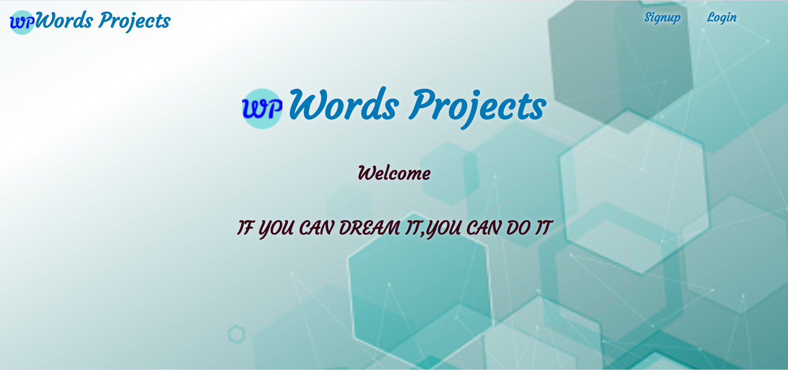
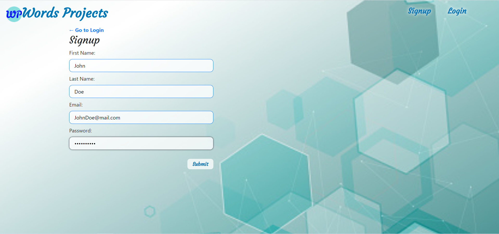
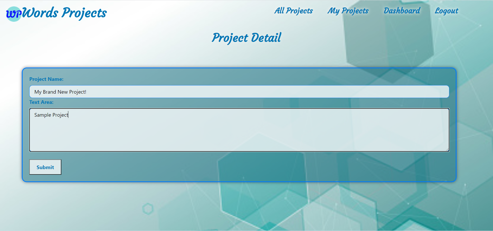
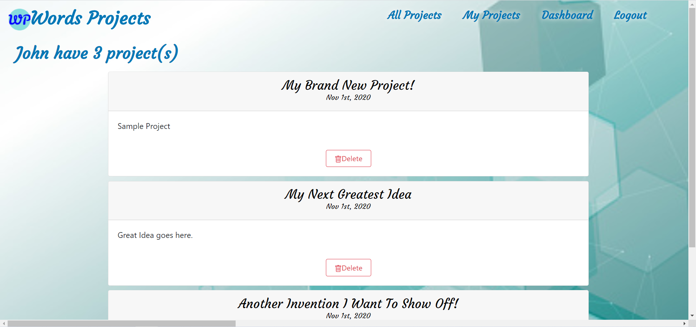

# Words Projects

## Description

Word Projects was built with the purpose of offering the users the opportunity to upload different ideas and or projects with the option to also receive funding towards their projects from other users.

In today's world, we feel it’s essential for entrepreneurs to have a place to show off their ideas, and be eligible to receive donations to fund their projects as well.

### Visit the site! [Words-Projects](https://wordsprojects.herokuapp.com/)

## Table of Contents
  * [Installation](#installation)
  * [Usage](#usage)
  * [License](#license)
  * [Technologies](#technologies)
  * [Questions](#questions)

## Installation
  Clone project to your machine and run npm install in terminal to get all of the dependencies. Run npm start to open the application locally.

## Usage
  New users must sign up in order to unlock all the features of Words-Projects.

  

  The Dashboard page is where you can begin sharing your new idea.

  

  Users can then publish their words project and it will display on their own personal tab My Project. 

  

  Users projects will also appear with everyone elses projects on the All Projects page. This page you can discover other users ideas and contribute to their projects as well. 

  

## License 
  This project is covered under the MIT license.

## Technologies

- MONGODB
- EXPRESS
- REACT
- NODE
- INDEXDB
- BOOTSTRAP
- GRAPHQL
- MOMENT
- JWT
- BCRYPT
- STRIPE
- APOLLO-SERVER-EXPRESS

## Contributors
- ANNIA VALDES
- BRANDON MCGUIRE
- JUSTIN OLDMIXON
- NICOLAS ESQUIVEL
- ZACHARY WAGNER

## Questions
  If you have any questions about the project, reach out to us below via our github profiles. 

  - [Annia](https://github.com/anniavd) 
  - [Brandon](https://github.com/brandonmcguire1992)
  - [Justin](https://github.com/jeoldmixon)
  - [Nicolas](https://github.com/NIKO09ES)
  - [Zachary](https://github.com/ZachWagner1)
